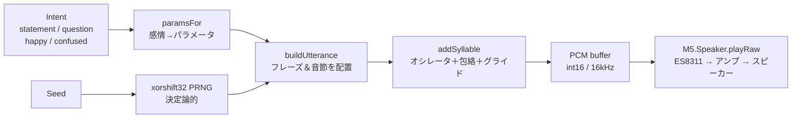

# m5-wheep

M5StickS3 で **非言語の「言語っぽいビープ音」** を生成して喋らせるテストプロジェクト。
スター・ウォーズの R2-D2 のように、意味のある単語は一つも含まないのに「何かを喋っている」ように聞こえる音声を、マイコン上で手続き的に合成する。

---

## 核心となる考え方

**「言語っぽさ」は音素（母音・子音）ではなく、韻律（プロソディ＝ピッチの上下とリズム）から生まれる。**

人間の脳は、意味のある単語が一つもなくても、ピッチの軌跡と間（ま）のリズムだけで「これはコミュニケーションだ」と判断する。
したがって、母音っぽい音色を作り込むよりも、**メロディとリズムを設計するほうがはるかに効く**。
本プロジェクトはこの原則に沿って、以下の 4 つの層を組み立てて発話を作る。

| 層 | 役割 | 実装上のポイント |
|----|------|-----------------|
| 1. ピッチ曲線（イントネーション） | 一番効く層。発話全体の「節回し」 | 文全体でじわじわ下がる自然下降（declination）＋語尾だけ意味のある動き |
| 2. 音節エンベロープ | 音を音節単位でオン/オフし、リズムを作る | 立ち上がり→減衰の振幅包絡。長短をばらつかせる（毎秒3〜8音節相当） |
| 3. フレーズ構造 | 音節をまとめ、区切りに間を置く | フレーズ頭でピッチをリセット、フレーズ間にポーズ |
| 4. 感情 → パラメータ | 「意味ありげ」に聞こえさせる | 意図ごとにピッチ範囲・速度・曲線の向きを割り当てる |

### 発話の骨格



ピッチ曲線と音節エンベロープが時間軸上で揃って並び、フレーズと間に分かれる。これが「ひと言まとまりを喋った」感を生む。

---

## 合成パイプライン

完全ランダムなノイズではなく、パラメータ駆動で PCM 波形（16-bit / 16 kHz）を生成し、ES8311 コーデック経由で再生する。



### 各ステップの原理

**オシレータ（音色）**
正弦波と矩形波を `harmonic` の比率でブレンドする。矩形波成分（奇数次倍音）を増やすほどブザー寄りになり、R2-D2 らしい電子的な声になる。

**振幅エンベロープ（クリック除去）**
各音節に「速い立ち上がり → 維持 → 緩やかな減衰」の包絡を smoothstep でかける。これがないと音節の境目でプチプチとノイズ（クリック）が出る。

**ピッチグライド＋ビブラート**
音節内でピッチを start→end へ滑らかに動かし、さらに `wobble` で微小な揺らぎを加える。固定ピッチの棒読みを避け、生き物っぽさを出す。

**自然下降（declination）**
発話が進むごとに基準ピッチを少しずつ下げる（`decl *= 0.985`）。人間の発話に共通する特徴で、これがあると「言い切った」感じが出る。

**語尾の動き**
最後の音節だけ `endMove` を適用する。`>1` なら上昇（疑問）、`<1` なら下降（断定）。文末のこの一手が、文タイプの印象を決める。

### 決定論的シード（重要）

同じ `(intent, seed)` からは必ず同じ発話が生成される。
完全ランダムだと毎回ばらけて単なる「ノイズ」に聞こえるが、入力からシードを固定すると、**同じ意図には毎回同じ節回し**が返り、「ちゃんと語彙を持って喋っている」感が一気に出る。R2-D2 が同じ場面で似た反応をするのと同じ効果。

---

## ハードウェア

| 項目 | 内容 |
|------|------|
| ボード | M5StickS3（ESP32-S3-PICO-1-N8R8 / 8MB Flash / 8MB PSRAM） |
| 音声出力 | ES8311 モノラルコーデック ＋ AW8737 パワーアンプ ＋ 内蔵スピーカー |
| ライブラリ | M5Unified（`M5.Speaker` 抽象がコーデックを管理） |

`M5.Speaker.tone()` で簡易ビープも鳴らせるが、本プロジェクトはピッチ曲線・包絡・音色を作り込むため、生成した PCM を `M5.Speaker.playRaw()` に渡す方式を採る。

---

## ビルドと実行

```bash
# m5-wheep/ 直下に platformio.ini、src/main.cpp を配置
pio run -e m5stack-sticks3 -t upload
```

書き込みモードに入らない場合は、側面のリセットボタンを長押しし、内部の緑 LED が点滅したらアップロードする。

**操作**

| ボタン | 動作 |
|--------|------|
| A（前面） | intent を切り替えながら発話（statement → question → happy → confused） |
| B（側面） | 直前の intent を新しいシードで再発話 |

---

## パラメータ調整

`paramsFor()` の値を変えると声色と表情が変わる。最初に触るとよいのは次の 5 つ。

| パラメータ | 意味 | 上げると |
|-----------|------|---------|
| `f0` | 基準ピッチ | 声が高くなる |
| `prange` | 抑揚の幅 | 表情が豊かになる |
| `harmonic` | 矩形波の比率 | ブザー寄り＝より電子的・R2-D2 っぽく |
| `wobble` | 揺らぎ | 不安定・とまどい感 |
| `endMove` | 語尾の上げ下げ | `>1` で疑問、`<1` で言い切り |

「もっと喋っている感がほしい」場合は、音節数の範囲（`irange(2,5)`）やフレーズ間の間（`addSilence`）を調整するのが効く。

---

## 注意点

- **M5Unified は GitHub master から取得すること。** StickS3 は新しく、PlatformIO レジストリ版では ES8311 スピーカーが未対応のことがある。
- **バッテリー駆動時は音量を上げすぎない。** 電力不足で再起動することがあるため、`setVolume` は控えめ（150 ≒ 59%、75% 未満）に設定している。

---

## 今後

`m5-record-play`（録音再生）との統合を想定している。録音再生側のスピーカー初期化はそのまま流用し、再生ソースを「録音バッファ」から「生成波形」に切り替えることで、マイコンが非言語の音声で応答する対話の土台にする。
